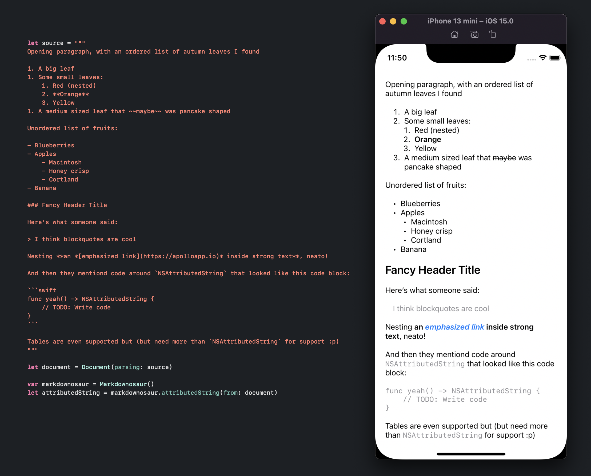

# Markdownosaur 🦖

Markdownosaur uses Apple's excellent and relatively new [Swift Markdown](https://github.com/apple/swift-markdown) library to analyze a Markdown source, and then takes that analyzed result and turns it into an `NSAttributedString` for displaying on screen on iOS, iPadOS, or Mac. It's just a few hundred lines long, and uses Apple's library's visitor pattern, so it's hopefully pretty easy to understand. :)

## Benefits

iOS 15 already [added a new initializer](https://developer.apple.com/documentation/foundation/nsattributedstring/3796598-init) to `NSAttributedString` that takes Markdown, you should probably check if that does what you want first! Beyond that, Markdownosaur offers:

- Increased flexibility in styling the resulting `NSAttributedString`
- Support for more Markdown elements (like tables, though this requires work from the user to integrate as it's beyond the scope of `NSAttributedString`)
- Support for iOS versions earlier than 15

## Install

Using Swift Package Manager, add [Apple's Swift Markdown library](https://github.com/apple/swift-markdown) to your project. Then simply take the `Markdownosaur.swift` file and add it to your project.

(Note that this library exists more to be helpful and instructive and was quickly generalized from how I use it, you'll likely want to modify it yourself for your own specific styling for instance!)

## Example Result

Here's the resulting `NSAttributedString` set on a `UILabel` (with the source Markdown visible).



## Usage

Simply pass in the source Markdown and then use the attributed string for whatever you'd like.

```swift
let source = "Here is some **very** cool and simple Markdown"
let document = Document(parsing: source)

var markdownosaur = Markdownosaur()
let attributedString = markdownosaur.attributedString(from: document)

// For instance…
label.attributedText = attributedString
```

## Performance

It's fast! Tiny bit faster than the `NSAttributedString` implementation in iOS 15 (Apple's implementation is probably more powerful though). For reference on an iPhone 6S Plus (oldest device that still gets iOS 15), I took `test.md` (which is included, and is just the 'Example Result' source above repeated 8x over) and it took about 0.04 seconds on average. This also compares to about 0.1 seconds on average for the same document using HTML -> NSAttributedString conversion via [DTCoreText](https://github.com/Cocoanetics/DTCoreText) (another excellent tool that I was using prior to this that handles a much wider HTML conversion).

## Thanks

Thanks to Apple for the awesome [Swift Markdown](https://github.com/apple/swift-markdown) library, and thanks to the [Down](https://github.com/johnxnguyen/Down) library for existing which helped me figure out how to tackle some aspects. Thank you as well to [@icanzilb](https://twitter.com/icanzilb) and [@QuietMisdreavus](https://twitter.com/QuietMisdreavus) for answering questions! 
